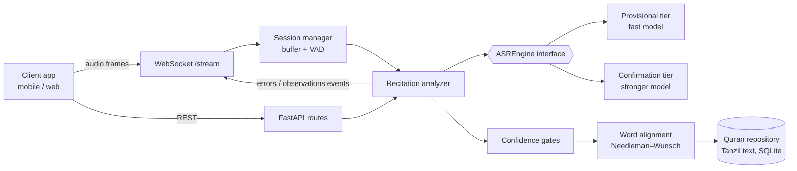

<div align="center">

# Quran AI Recitation & Correction API

**Realtime Quran recitation recognition with word-level mistake detection, over REST and WebSocket, running on an ordinary CPU.**


**Designed and built by [Muhammad Noman](https://github.com/MuhammadNoman2)**

</div>

---

## Overview

Apps that teach or check Quran recitation need to answer two questions while the user is still reciting:
*which verse is this?* and *did they make a mistake, and on which word?*
Generic speech-to-text answers neither well. It hallucinates words, it's slow on a CPU, and a naive "diff" wrongly
tells correct reciters that they made mistakes.

This API solves that as a service. A client app (mobile or web) streams microphone audio over a WebSocket and gets
back **word-by-word events**: provisional, confirmed correct, or confirmed mistake. The client never has to
know anything about the models underneath.

### Highlights

- **Two-tier streaming ASR.** A fast model gives instant *provisional* feedback. A stronger model *confirms* before anything is shown as a mistake.
- **Confidence gating against false corrections.** Uncertain results are returned as `observations`, never as `errors`. The key metric tracked is the **false correction rate**.
- **Verse detection.** Identifies which ayah is being recited from audio alone (n-gram + fuzzy matching).
- **Word alignment.** Needleman–Wunsch alignment of spoken words against the canonical text, with substitution / deletion / insertion scoring.
- **Tajweed and phoneme analysis** (optional image), with an honest record of what is and is not reliably detectable.
- **CPU-only inference.** CTranslate2 + ONNX Runtime, no PyTorch and no GPU needed on the default path. Measured real-time factor of **0.12** on a 60.7 s recitation (provisional tier; see [`docs/performance.md`](docs/performance.md)).
- **Production concerns built in:** API-key auth, rate limiting, bounded session store, structured JSON logs (never containing audio), versioned event protocol, Docker images.
- **Canonical text protection.** The Tanzil text is stored byte-for-byte unmodified, and a test enforces it.

### Architecture



Upper layers depend only on interfaces. Swapping or upgrading a model is a configuration change, not a rewrite.
Full design rationale: [`docs/architecture.md`](docs/architecture.md).

---

## Documentation

| Document | Contents |
|---|---|
| [`docs/model-selection.md`](docs/model-selection.md) | Models evaluated, benchmarks actually run, licences, risks |
| [`docs/architecture.md`](docs/architecture.md) | Layering, ASR abstraction, alignment, streaming design |
| [`docs/api.md`](docs/api.md) | Endpoints, response shape, error codes, latency |
| [`docs/realtime.md`](docs/realtime.md) | WebSocket protocol, events, scheduling |
| [`docs/phonetics.md`](docs/phonetics.md) | Phonemes, Tajweed, and what is actually detectable |
| [`docs/deployment.md`](docs/deployment.md) | Docker images, configuration, sizing |
| [`docs/performance.md`](docs/performance.md) | Measured benchmarks and what moves them |
| [`docs/cost-and-deployment.md`](docs/cost-and-deployment.md) | GPU/CPU costs, hosting, scaling ladder |

## Requirements

- Python 3.10+ (developed on 3.12)
- No GPU required. No PyTorch required — the inference path is CTranslate2 + ONNX Runtime.
- FFmpeg is **not** required (audio is decoded with PyAV).

## Setup

Everything installs into a project-local virtual environment. Nothing is installed
system-wide.

**macOS / Linux**

```bash
python3 -m venv .venv
source .venv/bin/activate
pip install -r requirements-dev.txt
cp .env.example .env
python scripts/prepare_quran_data.py
```

**Windows (PowerShell)**

```powershell
python -m venv .venv
.venv\Scripts\Activate.ps1
pip install -r requirements-dev.txt
copy .env.example .env
python scripts\prepare_quran_data.py
```

> **Intel Mac note:** `onnxruntime` must stay at `1.23.2` — it is the last release with
> a macOS x86_64 wheel. PyTorch has shipped no macOS x86_64 wheel since 2.2.2, which is
> why the inference path avoids torch entirely. See `docs/model-selection.md` §1.1.

## Tests

```bash
pytest            # 381 fast tests, no model download
pytest -m slow    # 46 integration tests against the real models (~220 MB first run)
```

## Quick start

```bash
./start
```

One command: creates the virtual environment if missing, builds the Quran data if
missing, starts the API with models preloaded, waits until it is genuinely ready,
and opens the live demo page. Ctrl-C stops everything.

Inside the VS Code terminal you can type just `start` — the workspace folder is on
`PATH` (see `.vscode/settings.json`).

### The demo page

<http://127.0.0.1:8000/> — pick a surah and ayah, press **Start reciting**, and
recite. Words light up as you go:

| | |
|---|---|
| amber | heard by the fast model — provisional, **never** a mistake claim |
| green | confirmed correct |
| red | a confirmed mistake, with what was heard shown above the word |
| dotted | unconfirmed — deliberately *not* presented as a mistake |

Deep-link a verse with `?surah=2&ayah=255`.

The page needs a microphone, which browsers only allow on a secure context — that
is why it is served by the API itself rather than opened as a file.

## Running in VS Code

Open the folder in VS Code. It is preconfigured (`.vscode/`):

1. **Select the interpreter** — `Cmd+Shift+P` → *Python: Select Interpreter* → `./.venv/bin/python`.
2. **Run the server** — `F5`, choose **API server (reload)**.
3. **Open** <http://127.0.0.1:8000/docs> and try any endpoint from the browser.

Other `F5` targets: *Streaming client example*, *Transcribe one file*, *Evaluate accuracy*.
`Cmd+Shift+P` → *Tasks: Run Test Task* runs the fast suite. Breakpoints work — use
**API server (no reload)**, since the reloader runs your code in a child process.

## Running the API

```bash
uvicorn app.main:app --reload
```

Interactive docs at <http://127.0.0.1:8000/docs>. A quick check:

```bash
curl -s localhost:8000/api/v1/health
curl -s -X POST localhost:8000/api/v1/recitation/analyze \
  -F audio=@data/test_audio/correct/001_002_husary_1.mp3 -F surah=1 -F ayah=2
```

### Live streaming

```bash
python examples/streaming_client.py data/test_audio/correct/001_002_husary_1.mp3 1 2
```

Streams the file in 100 ms frames like a microphone and prints every event. See
[`docs/realtime.md`](docs/realtime.md) for the protocol.

See [`docs/api.md`](docs/api.md), and `examples/` for Python, streaming and browser clients.

**Integrating?** `errors` are mistakes we are confident about; `observations` are
things we are *not* confident about. Never render `observations` as mistakes — that
re-introduces the false-correction problem the server works to prevent.

## Transcribing a recitation

```bash
python scripts/test_recitation.py \
  --audio data/test_audio/correct/001_002_husary_1.mp3 --surah 1 --ayah 2
```

Add `--tier provisional` for the fast tiny model, or `--json` for machine-readable
output. The script reports what the model heard and which words fall below the
confidence gate; it does **not** judge the reciter - use the evaluation script for that.

## Docker

```bash
docker compose -f docker/docker-compose.yml up api                # CPU, 958 MB
docker compose -f docker/docker-compose.yml --profile phonemes up  # + phoneme model
python scripts/smoke_test.py http://127.0.0.1:8000                 # 15 endpoint checks
```

The default image is torch-free and 958 MB. Phoneme and Tajweed *verification*
needs PyTorch, which cannot be installed on macOS x86_64 at all, so it lives in a
separate 2.82 GB image. See [`docs/deployment.md`](docs/deployment.md).

## Measuring accuracy

```bash
python scripts/evaluate_recitation.py
```

Reports word accuracy, substitution/deletion/insertion rates and - the number that
matters - the **false correction rate**: how often the system tells a reciter they
made a mistake when they did not. Add your own recordings first; see
`data/test_audio/README.md`.

## Project layout

```
app/
  asr/
    base.py               ASREngine interface, ASRResult, tiers
    whisper_engine.py     the only module that imports faster_whisper
    registry.py           one shared engine per tier
  audio/decoder.py        PyAV decoding to 16 kHz mono float32
  core/config.py          environment-driven settings
  models/schemas.py       versioned Pydantic models
  quran/
    repository.py         read-only access to the prepared Quran asset
    verse_locator.py      Scenario B: which verse is this? (n-gram + fuzzy)
  alignment/
    base.py               ExpectedWord, SpokenWord, AlignmentResult
    word_alignment.py     Needleman-Wunsch over word tokens
  api/
    deps.py               shared singletons: repo, index, engines
    routes/               health, quran, recitation, sessions
  core/
    errors.py             structured error codes
    logging.py            JSON logs; never audio
    security.py           API-key auth and rate limiting
  audio/buffer.py         bounded rolling buffer
  audio/vad.py            Silero VAD (ONNX, torch-free)
  streaming/
    session.py            session store with a hard capacity limit
    events.py             versioned WebSocket event protocol
    manager.py            per-session state and inference scheduling
    websocket.py          the /stream endpoint
  recitation/
    confidence.py         the gates that prevent false corrections
    scoring.py            deterministic word-accuracy score
    analyzer.py           orchestrates the pipeline
    text_normalizer.py    the four normalization representations
data/quran/quran.json     prepared asset (git-ignored, built by script)
data/test_audio/          evaluation corpus (see its README)
scripts/prepare_quran_data.py
scripts/test_recitation.py
scripts/evaluate_recitation.py
web/                    the live demo page (served at /)
examples/               python, streaming and browser clients
start                   one-command launcher
tests/unit/  tests/integration/
docs/
```

## Quran text attribution

This project uses the **Tanzil Quran Text** (Uthmani and Imlaey), via the
[`quran-transcript`](https://github.com/obadx/quran-transcript) package.

> Tanzil Quran Text
> Copyright © 2007–2024 Tanzil Project — <https://tanzil.net>
> Licensed under Creative Commons Attribution 3.0.
> Permission is granted to copy and distribute verbatim copies of this text,
> but **changing it is not allowed**.

The canonical text is stored unmodified. Every normalized or derived form is kept in a
separate field, and a test asserts the canonical text matches the source byte for byte.

## Licence

Application code © 2026 Muhammad Noman. All rights reserved: no open-source licence has been granted yet.
Third-party model and data licences are catalogued in `docs/model-selection.md` §6.

## Author

**Muhammad Noman**: full-stack engineer focused on AI systems and secure application development.
More work on my [GitHub profile](https://github.com/MuhammadNoman2).
